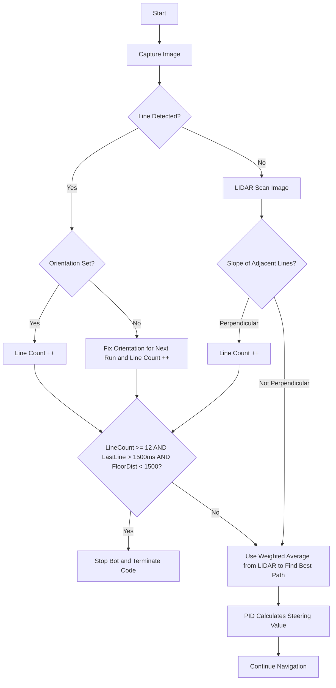
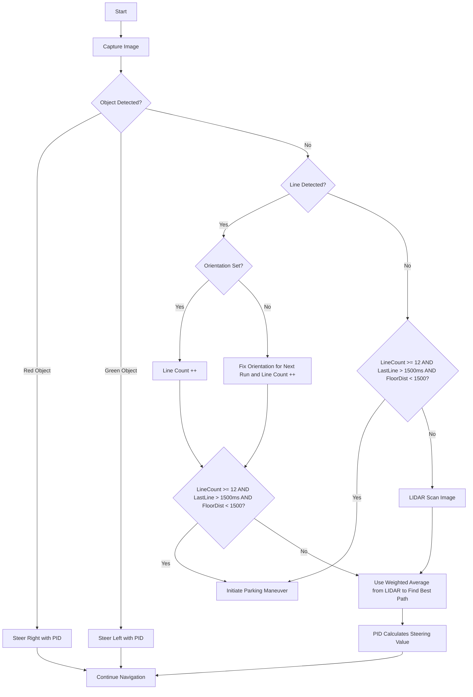

# 🤖 ** INTRODUCING TEAM PLADYTRON - WRO 2025 ** 🤖
# UPDATE: We placed 20th on the World Robot Olympiad 2024 (Turkey)

  

---

## 👥 **Team PLADYTRON**

- **Anas Bin Azim**  – Software & Hardware Developer | [anas.azim.71@gmail.com](mailto:anas.azim.71@gmail.com)
- **Mohiuddin Sami** – Primary Software Developer | [sm.mohiuddin.sami@gmail.com](mailto:sm.mohiuddin.sami@gmail.com)

**Team Origin**: Bangladesh

---

### 🌟 **The Meaning Behind PLADYTRON**

Our team name, “PLADYTRON,” dances between the realms of play and technology—a symphony of creativity and code. Like sparks igniting in the dark, our ideas come alive through the joyful spirit of discovery and the relentless pulse of innovation. But beyond the screens and circuits, there is an unseen force : our wellspring of strength: the unwavering support of those who walk beside us. Their hopes, whispered like secret blessings, fuel every challenge we embrace. In their quiet faith, we find the courage to dream bigger, to build stronger, and to journey farther. Pladytron is more than a name; it is the heartbeat of a shared dream, where joy and determination intertwine to create something truly extraordinary.

---

# The Team  

## Anas Bin Azim  

**Age:** 17  

**High School:** Adamjee Cantonment College, Dhaka 

**Description:** [Hi! I’m Anas from Bangladesh and this is my second WRO International season. In 2024, I had the honor of representing Team Mayerdoa Robotics at the World Robot Olympiad in Turkey, where we proudly placed 20th in the Future Engineers category. I’ve been deeply involved in robotics for over 4 years, building autonomous systems and competing in both national and international competitions. Beyond robotics, I’m passionate about programming, innovation, quizzing, traveling, and playing cricket]  

---

## Mohiuddin Sami  

**Age:** 17  

**High School:** Rajuk Uttara Model College, Dhaka 

**Description:** [.]  

## 🎉 Project Overview

This repository includes all files, designs, and code for **SMOKI**, our WRO 2024 robot. Below is the folder structure:

## 📂 Structure
Here’s a breakdown of the project folders:

- **`models`**: Contains 3D models and CAD designs.
- **`others`**: Additional documents and miscellaneous files.
- **`schematic`**: Wiring and circuit design diagrams.
- **`src`**: Source code for robot programming.
- **`system-setup`**: Steps for software and hardware setup.
- **`t-photos`**: Technical images of the robot build.
- **`v-photos`**: Visual photos for aesthetics and showcasing.
- **`video`**: Performance and demo videos of SMOKI.
- **`experiments`**: Documentation of trials and iterations with previous models.
- **`license`**: License information for the project.

---

## Robot Photos (All Directions)

<table>
  <tr>
    <td align="center"><b>Front</b></td>
    <td align="center"><b>Back</b></td>
  </tr>
  <tr>
    <td>
</td>
    <td>
</td>
  </tr>
  <tr>
    <td align="center"><b>Top</b></td>
    <td align="center"><b>Bottom</b></td>
  </tr>
  <tr>
    <td>
</td>
    <td>
</td>
  </tr>
  <tr>
    <td align="center"><b>Left</b></td>
    <td align="center"><b>Right</b></td>
  </tr>
  <tr>
    <td>
</td>
    <td>
</td>
  </tr>
</table>

----

Our bot, **SMOKI**, is built for excellence in the **World Robot Olympiad 2024** in the Future Engineers category. From its structural core using LEGO Technic elements to its computing capabilities powered by the **Raspberry Pi 5** and **ESP32 microcontroller**, SMOKI is crafted to handle the nuanced challenges of autonomous navigation and obstacle handling.

---

### Mission Overview for WRO Future Engineers Rounds

<table>
  <tr>
    <td width="50%" valign="top" align="left">
      <h3>🏁 Round 1: Lap Completion</h3>
      
In <strong>Round 1</strong>, the robot must autonomously complete <strong>three laps</strong> on a pre-defined track. The goal of this round is for the bot to demonstrate stable navigation and precise lap tracking without any obstacle avoidance requirements.

      <ul>
        <li><strong>Objective</strong>: Complete three laps on the track within the allotted time.</li>
        <li><strong>Key Tasks</strong>: Accurate path-following, speed control, and lap counting.</li>
      </ul>
      

             
        
      

    </td>
    <td width="50%" valign="top" align="left">
      <h3>🏆 Round 2: Lap Completion with Obstacle Avoidance and Parking</h3>
      
In <strong>Round 2</strong>, the bot must complete <strong>three laps</strong> while avoiding green and red obstacles:

      <ul>
        <li><strong>Green Obstacles</strong>: The bot should move <strong>left</strong> to avoid.</li>
        <li><strong>Red Obstacles</strong>: The bot should move <strong>right</strong> to avoid.</li>
      </ul>
      
After completing the laps, the bot must accurately park within a designated zone.

      <ul>
        <li><strong>Objective</strong>: Complete three laps, avoid obstacles, and park in the designated area.</li>
        <li><strong>Tasks</strong>: Obstacle detection, color-based avoidance, and precision parking.</li>
      </ul>
      

        
      

    </td>
  </tr>
</table>

---
>[!IMPORTANT]
>**Important: WRO Future Engineers Rulebook**
>* **Thorough Reading:** Ensure that you thoroughly read the **WRO Future Engineers 2024 Rulebook** to understand all rules and guidelines.
>* **Official Link:** Access the rulebook here: [🔗 WRO Future Engineers 2024 Rulebook](https://wro-association.org/competitions/future-engineers/).

---
---

## 🧩 Components and Hardware
Our bot is equipped with various components that support its autonomous functionality. Here is a breakdown of the key hardware elements used in this project:

| Component                  | Description                                                                                      | Image                          | Purchase Link                                                                                  |
|----------------------------|------------------------------------------------------------------------------------------------|--------------------------------|-----------------------------------------------------------------------------------------------|
| **Chassis - Custom Made**   | Custom-designed chassis tailored to fit all components and optimize stability and movement.    | 

         | N/A                                                                                           |
| **RPLIDAR C1**             | 360-degree laser scanner used for mapping and obstacle detection.                              | 

                   | [Purchase RPLIDAR C1](https://www.mybotshop.de/SLAMTEC-RPLIDAR-C1-360-Laser-Scanner-12-m)     |
| **Servo Motor SG90**       | Small, lightweight servo motor used for precise control of angles and positioning.             | 

             | [Purchase SG90](https://bongotech.ai/product/sg90-micro-servo-motor-180-degree)                |
| **SJ CAM C200**            | Captures visual data, supporting navigation and obstacle detection tasks.                      | 

                  | [Purchase SJ CAM C200](https://amzn.to/3SJCAM) (From previous knowledge)                      |
| **Buck Module XL4016**     | Provides stable voltage regulation for power management.                                      | 

           | [Purchase XL4016](https://amzn.to/4xl4016) (From previous knowledge)                          |
| **Motor Driver L293D**     | Dual H-Bridge motor driver for controlling DC motors and stepper motors.                       | 

           | [Purchase L293D](https://electropeak.com/l293d-motor-drive-shield)                            |
| **Booster Module 5V to 40V** | Voltage booster module to step up power supply from 5V to 40V, supporting high-voltage requirements. | 

       | [Purchase Booster Module](https://robu.in/product-category/electronic-modules/electronic-module/buck-boost-converter/boost-converter/) |

# Mobility Management :

#### 🛠️ Chassis Assembly Process

## CHASSIS FIRST FLOOR : 

This is the first floor of the robot chassis, designed to serve as the primary structural layer of the bot. The STL model shows a flat base plate with multiple precisely positioned mounting holes and slots for components.

Key Features:

Steering Shaft Mount: The elongated slot at the top center is designed to hold the steering shaft, ensuring smooth and stable movement.

Servo Motor Mount: Dedicated mounting holes allow the servo motor to be securely attached for steering control.

Camera Holder: The central cut-out and surrounding structure provide space for installing a camera for vision-based navigation.

Wheel Mounts: Side holes are aligned to support the wheels, making them properly fixed to the frame.

Base Support: This floor acts as the foundation of the robot, supporting the upper floors and ensuring stability during operation.

Dimensions:

Width (X): 101.5 mm

Length (Y): 185.0 mm

Thickness (Z): 10.0 mm

---
---

### CHASSIS STEERING :

This is the steering plate of the robot chassis, designed to integrate with the first floor and provide precise steering control. The central rectangular gap is a servo clearance slot, which allows the servo horn and linkage to move freely during steering. The smaller holes around the center are meant for mounting the servo securely, while the larger side holes provide attachment points to connect the steering plate with the rest of the chassis. The plate is compact yet durable, ensuring stability during turns, and it directly connects the servo motor to the steering shaft and wheels, making it an essential component for controlling the robot’s movement.

Dimensions:

Width (X): 96.2 mm

Height (Y): 35.55 mm

Thickness (Z): 10 mm

---
---

### STEERING SHAFT :

This part is the steering shaft of the robot chassis. It connects directly to the steering plate and transmits the motion from the servo motor to the wheels, enabling controlled directional movement. The design includes a central body with mounting cut-outs and side holes that allow it to be fixed securely to the chassis while maintaining free rotational movement where needed. Its sturdy build ensures that torque from the servo is effectively transferred to the wheels without bending or slipping, making it a key component for precise steering.

Dimensions:

Width (X): 

Height (Y): 

Thickness (Z): 

---
---

## CHASSIS SECOND FLOOR :

This is the second floor of the robot chassis, designed to mount the following components:

RPLIDAR C1 (with a 10 cm clearance ensured by floor orientation)

LiPo 1500mAh 9A 3S battery

STL Dimensions: 131.27 mm × 101.50 mm × 10.00 mm

The plate includes cutouts for weight reduction and cable management, along with mounting holes for secure installation. Its orientation was carefully adjusted to provide the RPLIDAR with optimal clearance for unobstructed 360° scanning.

---

## CHASSIS TOP FLOOR:

Top & 3rd Floor – Electronics Section

This floor of the chassis holds the core electronic components required for power regulation and motor control.

Components

Raspberry Pi 4B – Acts as the main controller, handling computation, control logic, and communication.

XL4016 Buck Converter – Steps down the LiPo battery voltage to the levels required by the Raspberry Pi and other electronics.

L293D Motor Driver – Provides motor control by supplying the necessary current and voltage to the DC motors.

Power Switch – Allows safe shutdown and startup of the electronics.

Veroboard – Serves as the wiring platform, connecting the Raspberry Pi, buck converter, motor driver, and switch.

Functionality

The LiPo battery powers the system.

The buck converter regulates the voltage for stable Raspberry Pi operation.

The L293D motor driver interfaces between the Raspberry Pi and the motors, enabling directional control.

The veroboard ensures secure and organized wiring between all components.

The switch provides overall power control for the floor.

---
---

>[!IMPORTANT]
> ALL THE STL AND DXF FILES ARE PROVIDED IN THE MODEL SECTION AND A PREVIEW OF THE WHOLE THING COMBINED IS GIVEN BELOW.
---

# TOTAL PREVIEW:

## Model Views

<table>
  <tr>
    <td align="center"><b>Top</b></td>
    <td align="center"><b>Bottom</b></td>
  </tr>
  <tr>
    <td>

</td>
    <td>
</td>
  </tr>
  <tr>
    <td align="center"><b>Left</b></td>
    <td align="center"><b>Right</b></td>
  </tr>
  <tr>
    <td>
</td>
    <td>
</td>
<tr>
    <td align="center"><b>Tilt1</b></td>
    <td align="center"><b>Tilt2</b></td>
  </tr>
  <tr>
    <td>
</td>
    <td>

</td>
  </tr>

</table>

---
---

# Mobility Management:

The mobility system of our robot has been meticulously designed to ensure smooth, efficient, and reliable movement, addressing both power distribution and maneuverability. This section outlines the evolution of our robot's mobility systems, including upgrades to the steering and gear systems.

---

#### **16GA 800 RPM DC Gear Motor**

<table>
<tr>
<td width="50%">

  

</td>
<td width="50%">

A **16GA DC gear motor** is a DC motor with an integrated gearbox. It provides controlled shaft rotation with increased output torque through gearbox reduction.

##### **How the Motor Works**
- The DC motor converts electrical input into rotational motion of the armature and shaft.  
- The gearbox stages reduce output speed and increase torque at the output shaft.  
- The D-flat on the shaft provides a positive mechanical interface for gears, pulleys, or couplings.

##### **Specifications**
- **Rated Speed:** 800 RPM  
- **Shaft Diameter:** 3.0 mm (D-flat: 2.5 mm)  
- **Gearbox Diameter:** 16 mm  
- **Gearbox Length:** 14 mm  
- **Motor Body Length:** 26.5 mm  
- **Shaft Length (protruding):** 11.2 mm

##### **Advantages**
1. **Compact Design**: Small gearbox diameter and short overall length for tight assemblies.  
2. **Increased Torque**: Gear reduction delivers higher torque at the output shaft for loaded conditions.  
3. **Positive Shaft Interface**: D-flat prevents rotary slip when fitted with set-screws or couplings.

</td>
</tr>
</table>

---

### **Rear Axle Power Distribution**

Initially, the rear wheels were powered through a **Bevel Gear**, but we later upgraded to a **Differential Gearbox** to improve efficiency and performance during turns.

---

#### **Bevel Gear**

<table>
<tr>
<td width="50%">

  

</td>
<td width="50%">

A **bevel gear** is a type of gear where the axes of the two shafts intersect, and the tooth-bearing faces of the gears are conical. Bevel gears are commonly used to transfer motion between intersecting shafts at an angle, typically 90°.

##### **How Bevel Gears Work**
- A driver gear transfers motion to a driven gear, which rotates an output shaft.
- The teeth of the gears are designed to mesh smoothly, transferring torque efficiently between the shafts.

##### **Advantages of Bevel Gears**
1. **Compact Design**: Suitable for space-constrained applications.
2. **Efficient Torque Transfer**: Provides reliable power transmission at angles.
3. **Versatility**: Can operate at angles other than 90° if needed.

</td>
</tr>
</table>

---
>[!IMPORTANT]
> Bevel gears were essential in the initial stages of our design, but they had limitations in terms of energy efficiency during turns.
---

#### **Differential Gearbox**

<table>
<tr>
<td width="50%">

A **differential gearbox** allows the wheels on the same axle to rotate at different speeds while receiving power from a single motor. This is crucial for smooth turning, where the outer wheel must travel a larger distance than the inner wheel.

##### **Advantages of Differential Gearbox**
1. **Smooth Turns**: Adapts to varying wheel speeds, ensuring efficient cornering.
2. **Energy Efficiency**: Reduces energy wastage by minimizing wheel slippage.
3. **Component Longevity**: Minimizes wear on tires and axles.

##### **How Differential Gears Work**
- Power from the motor is delivered to an input shaft.
- The differential splits the torque between the two wheels via bevel or spider gears inside the housing.
- During turns, the differential allows one wheel to spin faster than the other, ensuring smooth movement.

</td>
<td width="50%">

  

</td>
</tr>
</table>

---

### **Servo Motor with L293D Motor Driver**

<table>
<tr>
<td width="30%">

  

</td>
<td width="70%">

We used the **L293D Motor Driver** in combination with a **Servo Motor** to control the robot's wheels effectively. The L293D is a dual H-Bridge motor driver that is perfectly suited for the LEGO motor, which operates at **750mA** current.

##### **Why L293D?**
- **Optimal Current Capacity**: Can handle up to **1A** peak current, suitable for the LEGO motor’s 750mA requirement.
- **Bidirectional Control**: Facilitates forward and backward motion of the wheels.
- **Compact and Lightweight**: Ideal for small-scale robotic systems.
- **PWM Support**: Enables smooth speed control of the motors.

##### **Advantages of the Servo Motor with L293D**
1. **Accurate Steering**: The servo motor ensures precise angle adjustments.
2. **Smooth Speed Control**: PWM functionality provides variable speed control.
3. **Efficient Current Management**: Matches the LEGO motor's current needs, ensuring reliable operation.

</td>
</tr>
</table>

---

#### **Comparison: Bevel Gear vs. Differential Gearbox**

| **Feature**                | **Bevel Gear**                            | **Differential Gearbox**                |
|----------------------------|-------------------------------------------|-----------------------------------------|
| **Turning Efficiency**     | Limited; fixed wheel speeds.             | Superior; wheels rotate independently. |
| **Energy Usage**           | Higher due to slippage during turns.     | Lower; optimized for dynamic turns.    |
| **Durability**             | Higher strain on components.             | Reduced strain; longer component life. |

---

### **Steering Systems**

The robot was first designed with an Ackermann Steering System, which is widely recognized for its efficiency in full-scale vehicles where smooth and realistic cornering is important. This system was chosen because it closely replicates how cars steer, making it ideal for projects that aim to simulate real-world vehicle dynamics. However, as the design of the robot progressed, the steering system was later replaced with a LEGO-based steering mechanism. The change was made to simplify construction, reduce complexity, and improve modularity, all while maintaining effective and reliable steering control. The LEGO steering setup makes it easier to experiment, repair, and scale the design without sacrificing too much performance, which is an important advantage in prototyping and educational robotics.

The Ackermann Steering System itself is a clever mechanical arrangement that ensures each wheel follows a natural path while the vehicle turns. In any cornering situation, the inner wheels of a vehicle must rotate at a sharper angle than the outer wheels because they travel along a smaller radius. Without this adjustment, wheels would slip or drag, leading to wasted energy and uneven motion. The Ackermann geometry solves this by connecting the front wheels through steering arms angled in such a way that the imaginary extension of these arms intersects at the center of the turn’s radius. This alignment ensures that all wheels follow concentric paths, allowing the vehicle to turn smoothly and efficiently without excessive tire wear or unnecessary power loss.

In practice, the Ackermann system has several clear advantages for robotic applications. It minimizes slippage between the wheels and the ground, which results in more efficient turning and better energy conservation. The reduction of wheel drag also means that the motors driving the vehicle consume less power during maneuvers, which is especially valuable in battery-powered robots where energy efficiency extends operating time. Another key benefit is that it provides a highly realistic simulation of how cars steer, making it particularly useful for robotics projects that aim to mimic real-world automotive systems or serve as educational platforms to demonstrate fundamental vehicle dynamics. Although our project ultimately transitioned to a LEGO-based steering approach for modularity and ease of construction, the principles and advantages of Ackermann steering remain highly relevant for anyone interested in understanding efficient and practical steering systems in robotics and beyond.

---
---

## **SERVO MOTOR :** 
# Servo Motor - Tower Pro MG90S

<table>
  <tr>
    <td>
      
    </td>
    <td>
      <h3>Specifications</h3>
      <ul>
        <li><strong>Weight:</strong> 13.4g</li>
        <li><strong>Stall torque:</strong> 2.2 kgf·cm (6V)</li>
        <li><strong>Operating speed:</strong> 0.08 s/60° (6V)</li>
        <li><strong>Rotation angle:</strong> 120°</li>
        <li><strong>Gear type:</strong> Metal gears</li>
        <li><strong>Operating voltage:</strong> 4.8V – 6V</li>
      </ul>
    </td>
  </tr>
</table>

---

The Tower Pro MG90S is a micro servo motor designed for applications where compact size and high torque are required, making it a reliable choice for robotics, RC models, and automation projects. Built with durable metal gears, it offers a longer operational lifespan compared to plastic-geared alternatives, while maintaining a lightweight 13.4g profile that makes it easy to integrate into small-scale designs. Operating on a voltage range of 4.8V to 6V, it delivers up to 2.2 kgf·cm stall torque and a quick 0.08s/60° response at 6V, ensuring both strength and speed for demanding tasks. With a rotation range of 120°, the MG90S provides precise angular control suitable for robotic arms, pan-tilt camera gimbals, or steering systems in miniature vehicles. Its compatibility with standard PWM signals means it can be driven directly by most microcontrollers, including Arduino and Raspberry Pi, without the need for additional hardware. Engineers and hobbyists often choose the MG90S because it balances performance and durability in a very small form factor, making it a practical and cost-effective solution for projects that require accurate movement and dependable performance under continuous load.

---

## Where to Buy

You can purchase the servo motor here:  
👉 [Tower Pro MG90S - Cleste.ro](https://cleste.ro/motor-servo-mg90s-180g.html)

## SERVO-HOLDER :

### SG90 / MG90 Servo Holder

This is a **servo motor holder/mount** designed for **SG90** and **MG90S micro servos**.  
It provides a secure and stable way to fix the servo motor onto different surfaces such as a robot chassis, acrylic base, or wooden frame.

---

## Description
## Servo Motor Holder / Mount (SG90 & MG90S)

This servo motor holder is designed specifically for the popular SG90 and MG90S micro servos, providing a secure and reliable way to mount the motor onto different surfaces such as a robot chassis, acrylic base, or even wooden frames. The primary goal of the mount is to eliminate instability and vibration, ensuring that the servo can deliver accurate and repeatable movements during operation. For small-scale robotics and automation projects where precision matters, this holder becomes an essential accessory.
The base of the mount is a flat rectangular plate equipped with four mounting holes that allow it to be firmly attached using screws or bolts. This rigid foundation ensures that once the holder is installed, it remains stable and does not shift under load, even when the servo is driving linkages or mechanical arms. At the center of the design, there is a servo housing slot carefully dimensioned to snugly fit SG90 and MG90S servos. This slot prevents any side-to-side play and keeps the servo perfectly aligned, which is important when the servo is used for steering mechanisms, grippers, or robotic arms where accuracy of angular motion is critical.
On the sides of the housing are clamp sections with additional screw holes, which allow the servo to be tightly locked in place once inserted. This design makes sure the servo remains fixed during continuous operation, preventing unwanted movement that could lead to mechanical inaccuracy or wear. At the front, the mount features an open clearance space that allows the servo horn or arm to rotate freely without obstruction. This ensures that the servo’s full range of motion can be utilized, whether it is controlling wheels, levers, or pan-tilt systems.

The bottom of the mount is left open to provide space for the servo’s wiring to pass through. This prevents cable bending and stress at the connector, reducing the risk of damage to the wires over time and allowing easy integration into compact robotic builds. By providing both mechanical stability and practical cable management, the holder is designed to extend the lifespan of the servo and improve overall reliability of the system.

In terms of material, PLA is often sufficient for hobby projects where light loads and indoor conditions are expected. However, for applications requiring greater durability or exposure to outdoor environments, PETG or ABS is recommended since both materials offer improved toughness and resistance to stress compared to PLA. The mount’s design is fully compatible with Tower Pro SG90 and MG90S servos, making it versatile for use across a wide range of robotic and automation projects where these micro servos are commonly deployed.

---
---
# ⚡ Power and Sense Management

The **Power and Sense Management** system of our robot has been meticulously designed to optimize performance while ensuring reliable power delivery, precise sensing, and efficient communication between components.
# Battery: Gens Ace Airsoft 3S Li-Po Battery (11.1V 1500mAh 35C)

<table>
  <tr>
    <td>
      
    </td>
    <td>
      <h3>Specifications</h3>
      <ul>
        <li><strong>Brand:</strong> Gens Ace Airsoft</li>
        <li><strong>Battery Type:</strong> Li-Po (Lithium Polymer)</li>
        <li><strong>Nominal Voltage:</strong> 11.1V (3S)</li>
        <li><strong>Capacity:</strong> 1500 mAh</li>
        <li><strong>Energy:</strong> 16.65 Wh</li>
        <li><strong>Discharge Rate:</strong> 35C</li>
        <li><strong>Connector Type:</strong> T-Plug / Deans Connector</li>
        <li><strong>Balance Plug:</strong> JST-XH</li>
        <li><strong>Weight:</strong> ~120g</li>
      </ul>
    </td>
  </tr>
</table>

---

The **Gens Ace 3S Li-Po battery** is a lightweight and powerful energy source designed for high-performance robotics, drones, RC vehicles, and airsoft equipment.  
With a **capacity of 1500mAh** and a **35C discharge rating**, it delivers consistent current output suitable for motors, sensors, and controllers that require stable power.  
Its **compact size and low weight** make it easy to integrate into mobile robotic platforms.  
The built-in **Deans/T-Plug connector** ensures low-resistance power delivery, while the **JST-XH balance connector** allows for safe charging and cell balancing.  

This battery is ideal for applications requiring **high burst currents, reliability, and long cycle life**, making it a solid choice for powering small-to-medium robotics systems.

---

# **Microcontroller :**  
# Raspberry Pi 4 Model B

<table>
  <tr>
    <td>
      
    </td>
    <td>
      <h3>Specifications</h3>
      <ul>
        <li><strong>Processor:</strong> Broadcom BCM2711, Quad-core Cortex-A72 (ARM v8) 64-bit SoC @ 1.5GHz</li>
        <li><strong>RAM Options:</strong> 2GB, 4GB, or 8GB LPDDR4-3200 SDRAM</li>
        <li><strong>Networking:</strong> Gigabit Ethernet, 2.4GHz & 5.0GHz 802.11ac Wi-Fi, Bluetooth 5.0</li>
        <li><strong>USB Ports:</strong> 2 × USB 3.0, 2 × USB 2.0</li>
        <li><strong>Video & Sound:</strong> 2 × micro-HDMI ports (up to 4Kp60), MIPI DSI display port, MIPI CSI camera port</li>
        <li><strong>Storage:</strong> microSD card slot for OS and data storage</li>
        <li><strong>GPIO:</strong> 40-pin header, backward-compatible with previous Raspberry Pi boards</li>
        <li><strong>Power:</strong> 5V DC via USB-C connector (minimum 3A)</li>
        <li><strong>Dimensions:</strong> 85.6mm × 56.5mm</li>
      </ul>
    </td>
  </tr>
</table>

---

The **Raspberry Pi 4 Model B** is a powerful single-board computer that serves as the main controller of the robot.  
It offers significant improvements over previous models, including a faster **quad-core ARM Cortex-A72 CPU**, more memory options, dual micro-HDMI outputs supporting **dual 4K displays**, and faster networking with **true Gigabit Ethernet** and **dual-band Wi-Fi**.  
Its 40-pin GPIO header provides compatibility with a wide range of sensors, motor drivers, and other modules, making it extremely versatile for robotics and IoT applications.  

Thanks to its **USB 3.0 ports**, it can interface with high-speed peripherals such as cameras, LIDAR sensors, or external storage, while the **USB-C power input** ensures stable operation.  
In this project, the Raspberry Pi 4B acts as the **central brain**, handling computer vision, path planning, and high-level decision-making, while coordinating with microcontrollers, sensors, and actuators to control the entire robot.

---

## **GPIO PINOUT OF RPI 4B** : 

# Raspberry Pi 4 Model B GPIO (40-pin Header)

<table>
  <tr>
    <td>
      
    </td>
    <td>
      <h3>Specifications</h3>
      <ul>
        <li><strong>Total Pins:</strong> 40 (2×20 header)</li>
        <li><strong>Power Pins:</strong> 2 × 5V, 2 × 3.3V, 8 × Ground (GND)</li>
        <li><strong>GPIO Pins:</strong> 26 (configurable as input/output)</li>
        <li><strong>Dedicated Interfaces:</strong> 
          <ul>
            <li>UART (TXD, RXD)</li>
            <li>SPI (MOSI, MISO, SCLK, CE0, CE1)</li>
            <li>I²C (SDA, SCL)</li>
            <li>PWM channels</li>
          </ul>
        </li>
        <li><strong>Voltage Levels:</strong> 3.3V logic (NOT 5V-tolerant)</li>
        <li><strong>Backward Compatibility:</strong> Same pinout as Raspberry Pi 3B/3B+</li>
      </ul>
    </td>
  </tr>
</table>

---

The **Raspberry Pi 4B GPIO header** provides 40 pins that allow direct hardware interfacing with sensors, actuators, and external modules.  
Among these are multiple **power pins (5V and 3.3V)**, **ground pins**, and **26 flexible GPIO pins** which can be programmed as input or output using libraries such as **RPi.GPIO** or **GPIO Zero**.  

The header also exposes dedicated hardware interfaces, including **UART for serial communication**, **SPI for high-speed device connections**, and **I²C for multi-sensor integration**, along with PWM support for driving **motors, LEDs, and servos**.  

Because the pins operate at **3.3V logic levels**, external level shifters are required when interfacing with 5V components.  
This GPIO header is the bridge between the Raspberry Pi and the physical world, making it an essential feature for robotics, IoT, and embedded system projects.

---
---

## **BUCK CONVERTER** (8.4 TO 5V) : 
### XL4016 DC-DC Step-Down Module

<table>
  <tr>
    <td>
      
    </td>
    <td>
      <h3>Specifications</h3>
      <ul>
        <li><strong>Chipset:</strong> XL4016E1 DC-DC Buck Converter</li>
        <li><strong>Input Voltage:</strong> 8V – 36V DC</li>
        <li><strong>Output Voltage:</strong> 1.25V – 32V DC (adjustable)</li>
        <li><strong>Output Current:</strong> Up to 8A (continuous), 12A peak</li>
        <li><strong>Conversion Efficiency:</strong> Up to 95%</li>
        <li><strong>Switching Frequency:</strong> ~180 kHz</li>
        <li><strong>Protections:</strong> Over-current, thermal shutdown</li>
        <li><strong>Heat Dissipation:</strong> Integrated heatsink for stability under high load</li>
        <li><strong>Dimensions:</strong> 60mm × 52mm × 20mm (approx.)</li>
      </ul>
    </td>
  </tr>
</table>

---

The **XL4016 buck converter** is a high-power DC–DC step-down module designed to provide stable and efficient voltage regulation for robotics, automation, and embedded systems. With an input range of 8–36V and an adjustable output from 1.25–32V, it is highly versatile and can power a wide variety of subsystems from a single battery source. Its ability to deliver up to **8A of continuous current** (with peaks of 12A) makes it suitable for driving motor controllers, Raspberry Pi boards, and other current-hungry electronics simultaneously. The module achieves up to 95% efficiency, reducing energy losses and minimizing heat buildup. The integrated heatsink ensures stable operation even under heavy loads, while built-in protection circuits safeguard against over-current and thermal issues. For robotics applications, the XL4016 is often recommended because it allows a single Li-Po or Li-ion battery pack to be safely stepped down to multiple regulated voltages, ensuring reliable operation of both logic-level electronics and power-hungry actuators.

---

## **Sensor :**  
# MPU-6050 6-Axis Gyroscope and Accelerometer

<table>
  <tr>
    <td>
      
    </td>
    <td>
      <h3>Specifications</h3>
      <ul>
        <li><strong>Chipset:</strong> InvenSense MPU-6050</li>
        <li><strong>Sensor Type:</strong> 3-axis gyroscope + 3-axis accelerometer</li>
        <li><strong>Operating Voltage:</strong> 3V – 5V</li>
        <li><strong>Communication Interface:</strong> I²C (default address 0x68)</li>
        <li><strong>Gyroscope Range:</strong> ±250, ±500, ±1000, ±2000 °/s</li>
        <li><strong>Accelerometer Range:</strong> ±2g, ±4g, ±8g, ±16g</li>
        <li><strong>Sampling Rate:</strong> Up to 1 kHz</li>
        <li><strong>Digital Motion Processor (DMP):</strong> Built-in for sensor fusion</li>
        <li><strong>Dimensions:</strong> ~20mm × 15mm × 2mm (module size varies)</li>
      </ul>
    </td>
  </tr>
</table>

---

The **MPU-6050** is a 6-axis motion tracking sensor that integrates a **3-axis gyroscope** and a **3-axis accelerometer** on a single chip, making it one of the most widely used sensors in robotics and embedded systems. It communicates via the I²C protocol, which allows it to connect easily to microcontrollers like the Arduino, ESP32, or Raspberry Pi. The sensor provides motion data across multiple selectable ranges, with gyroscope sensitivity from ±250 to ±2000 degrees per second and accelerometer ranges from ±2g to ±16g. This versatility makes it suitable for detecting orientation, angular velocity, and linear acceleration in real time. The built-in **Digital Motion Processor (DMP)** can handle sensor fusion internally, combining gyro and accelerometer data to output stable orientation values, reducing the computational load on the main controller. For robotics, the MPU-6050 is commonly used in balancing robots, drones, navigation systems, and motion-controlled projects, where accurate and responsive motion sensing is essential for stability and control.

---

## **Camera :**  
# SJCAM C200 Action Camera

<table>
  <tr>
    <td>
      
    </td>
    <td>
      <h3>Specifications</h3>
      <ul>
        <li><strong>Sensor:</strong> 4K CMOS image sensor</li>
        <li><strong>Video Resolution:</strong> 4K @ 24fps, 2K @ 30fps, 1080p @ 60fps</li>
        <li><strong>Photo Resolution:</strong> Up to 16MP</li>
        <li><strong>Lens:</strong> 154° wide-angle lens</li>
        <li><strong>Display:</strong> 1.3-inch front screen + status indicators</li>
        <li><strong>Battery:</strong> 1200mAh (removable, USB-C charging)</li>
        <li><strong>Connectivity:</strong> Wi-Fi, USB-C</li>
        <li><strong>Storage:</strong> MicroSD card up to 128GB</li>
        <li><strong>Waterproof:</strong> Up to 5m without case, 30m with case</li>
        <li><strong>Dimensions:</strong> ~68mm × 32mm × 26mm</li>
      </ul>
    </td>
  </tr>
</table>

---

The **SJCAM C200** is a compact 4K action camera designed for high-quality video and photo capture in robotics, drones, and field-testing environments. It features a **154° wide-angle lens**, making it well-suited for wide field-of-view applications such as navigation, mapping, and vision-based obstacle detection. The camera supports recording at multiple resolutions, including **4K at 24fps** and **1080p at 60fps**, giving flexibility between image detail and frame rate depending on the task. With a removable **1200mAh battery** and **USB-C charging**, it provides convenient power management, while Wi-Fi connectivity allows real-time preview and data transfer to companion devices. Its rugged design makes it waterproof up to 5m without housing and up to 30m with an additional case, ensuring reliable performance in outdoor and challenging environments. For robotics projects, the SJCAM C200 is an excellent choice as a vision module, balancing portability, durability, and high-definition imaging in a small and versatile package.
---
---

# *PCB*  
## Previous PCB Design and Power Distribution  

| **Top View of PCB** | **Bottom View of PCB** | **Power Management Diagram** |
|----------------------|------------------------|-------------------------------|
|  |  |  |

---

The PCB shown above was designed as the **central power management and distribution unit** for the robot, ensuring that every subsystem received the correct voltage and current for stable operation. The board draws power from two **Lithium-Ion cells**, each rated at 4.2V, providing a combined supply of **8.4V** when fully charged. This input is then carefully regulated using multiple DC–DC converters to meet the diverse requirements of the system.  

At the heart of the regulation stage, an **XL4016 buck converter** steps the 8.4V battery voltage down to a stable **5V rail**, which powers the **Raspberry Pi 5** and other core electronics. Additional buck converter modules are integrated to provide subsystem-specific voltages: one module regulates to **6V for the servo motor**, while another supplies **5V dedicated to the ESP32 microcontroller**, ensuring isolation and consistent operation. For the high-power motors, the PCB incorporates a **buck-boost converter** that outputs **12V**, guaranteeing reliable torque and speed even as the battery voltage drops during operation.  

This combination of regulated rails allows the robot to operate multiple controllers, sensors, and actuators from a single compact PCB without instability or power loss. By integrating switching converters and carefully routing the distribution, the board minimizes heat, maximizes efficiency, and protects sensitive comp
onents from voltage fluctuations. Overall, this design highlights the importance of structured power management in robotics, where both logic-level devices and power-hungry actuators must coexist seamlessly on the same platform.

---
# *CurrentPCB* :

Compared to our earlier design, the new PCB introduces several improvements aimed at stability, modularity, and ease of use. The earlier version primarily served as a basic power distribution board with buck converters and minimal control features. In this revised version, additional attention has been given to **structured wiring via ribbon connectors**, improved **switching and manual control through a larger rocker and push button**, and **better integration of the buck converter section** with heat dissipation. The placement of capacitors, inductor coil, and screw terminals has been optimized for cleaner power flow, and the routing now reduces noise and voltage drops across the board. Overall, the new design is more robust, reliable, and serviceable compared to the prototype.  

### 🎥 Camera Placement and Functionality

The robot's main camera is positioned at the top and angled slightly downwards. This setup enhances object detection capabilities by providing:
- **🔍 Close-Range Detection**: The camera can identify objects in close proximity with high accuracy.
- **🌐 Extended-Range Detection**: Ensures objects further away are detected effectively.

The camera feeds data to the **Raspberry Pi 4**, which processes image recognition algorithms to detect towers and corner lines. The processed data is then transmitted to the **ESP32 microcontroller** for real-time navigation and obstacle avoidance.

---

### 📡 Sonar Mount Design

### 🛠️ Previous Design
In our earlier design, we used **HC-SR04 sonar sensors** placed at **45-degree angles**, mounted horizontally on two sides of the robot, with one sensor placed vertically in the middle. This configuration provided basic obstacle detection but had limitations:
- **🚫 Blind Spots**: The horizontal placement created gaps in detection range at certain angles.
- **⚠️ Inconsistent Readings**: The 45-degree angle sometimes caused inaccuracies due to signal reflections.

### 🔄 Why We Switched
After analyzing performance during testing, we made significant improvements:
- Replaced the 45-degree sensors with sensors mounted at **15 degrees**.
- Mounted the sensors **vertically on all sides**, ensuring:
  - **🛑 Improved Obstacle Detection**: Enhanced accuracy and coverage around the robot.
  - **📏 Better Range Consistency**: Reduced signal reflection issues for more reliable readings.

###  Current Design
The new configuration leverages **HC-SR04 sonar sensors**, chosen for their **wide availability** and **affordable price**. The updated design provides:
- **360° Coverage**: Vertical mounting eliminates blind spots.
- **Early Detection**: Enhanced obstacle sensing allows for quicker decision-making.

---

>[!IMPORTANT]
> **Power Highlights:**
> - The XL4016 Buck Converter ensures stable voltage regulation, critical for protecting the Raspberry Pi and ESP32 microcontroller during operation.
> - Independent buck modules handle the servo motor and ESP32 power needs, optimizing energy usage across all components.

---
---

## Power Regulation and Control PCB

This PCB is a custom-made prototyping board that acts as the main power regulation and control hub of the robot. It integrates a red rocker switch as the primary ON/OFF control, a large red push button for reset or emergency stop functions, and a green LED that indicates when the system is active. Flat ribbon cables connect the board to the Raspberry Pi or Arduino, carrying essential GPIO signals. The lower section features a copper coil, multiple electrolytic capacitors, and MOSFETs/regulators that form a DC–DC converter, ensuring stable power delivery from the battery to different subsystems. Blue trimpots allow precise voltage calibration, while a screw terminal block provides secure connections for input and output wiring. Altogether, this PCB manages distribution, stabilization, and manual control of power, making it a central part of the robot’s electronic system.

---

# 🧠 Program Infrastructure and Explanation ## 🏁 Round 1 Algorithm - Lap Completion

In **Round 1**, our robot **SMOKI** must autonomously complete **three laps** on a predefined track without the need for obstacle avoidance. To achieve precise navigation and lap counting, we have developed a robust algorithm that integrates image processing with control systems.

---

### 🌐 Algorithm Overview

1. **📸 Image Acquisition**:
   - The robot captures real-time images of the track using its onboard camera.

2. **🎨 Color Space Conversion**:
   - Captured images are converted from the **RGB** color space to the **HSV (Hue, Saturation, Value)** color space.
   - The HSV color space is chosen for its effectiveness in color segmentation, as it is less sensitive to lighting variations.

3. **🔍 Color Segmentation and Orientation Determination**:
   - Using predetermined HSV ranges, the algorithm isolates the **blue** and **orange** line segments on the track.
   - During the first run, the robot checks whether the blue line appears before the orange line or vice versa.
   - **Orientation Determination**:
     - If the blue line comes before the orange line, the robot sets its orientation accordingly.
     - This initial orientation check ensures the robot follows the track in the correct direction.

4. **📏 Line Detection and Lap Counting**:
   - The **Hough Line Transform** method is applied to detect lines within the segmented images.
   - The robot counts the detected lines to keep track of laps.
   - **Lap Completion**:
     - After counting **12 lines** (corresponding to three laps), the robot initiates a predetermined delay and then stops.

5. **⚙️ Position Correction Using PID Control**:
   - Before setting the orientation, a **PID (Proportional-Integral-Derivative) controller** calculates the error.
   - **Error Calculation**:
     - The error is determined by the difference between the distances measured by sensors on the left and right sides of the robot (i.e., `error = left_distance - right_distance` or vice versa).
   - **Distance Maintenance**:
     - If the orientation is **right-based**, the robot maintains a **25 cm** distance from the right side.
     - If the orientation is **left-based**, it maintains a **25 cm** distance from the left side.
   - The PID controller adjusts the robot's steering to minimize the error, helping it stay centered on the track.

---

## 📖 Detailed Explanation

### 1. 📸 Image Acquisition and Preprocessing
- **Camera Input**: High-resolution images are captured at regular intervals to ensure up-to-date visual data.
- **HSV Conversion**: Conversion to HSV allows for more effective color thresholding. HSV separates image intensity (Value) from color information (Hue and Saturation), making it easier to detect specific colors under varying lighting conditions.

### 2. 🎨 Color Segmentation
- **HSV Thresholding**: 
  - **Blue Line Detection**: Pixels within the blue HSV range are extracted.
  - **Orange Line Detection**: Pixels within the orange HSV range are extracted.
- **Orientation Check**: By analyzing the sequence of color segments (blue vs. orange), the robot determines its starting orientation. This prevents incorrect lap counting due to starting in the wrong direction.

### 3. 📏 Line Detection with Hough Transform
- **Edge Detection**: Preprocessing steps like Gaussian blur and Canny edge detection are applied to enhance line features.
- **Hough Line Transform**: Detects straight lines by transforming points in image space to a parameter space. Lines are identified based on the accumulation of intersecting points in the parameter space.
- **Lap Counting Logic**: Each detected line crossing increments a counter. The robot recognizes lap completion after counting **12** line crossings, accounting for both blue and orange lines over three laps.

  <!-- Placeholder for Hough Line Transform Image -->

  
  
<em>Figure: Visualization of Hough Line Transform applied to track image.</em>

#### 🔗 **Hough Line Transform Tutorial**

For a comprehensive understanding of the Hough Line Transform method, you can watch this detailed tutorial:

- [🔗 Hough Line Transform Tutorial by DigitalSreeni](https://www.youtube.com/watch?v=5zAT6yTHvP0&ab_channel=DigitalSreeni)

### 4. ⚙️ PID Control for Position Correction
- **Sensor Input**: Distance sensors on both sides provide real-time measurements of the robot's position relative to the track edges.
- **Error Calculation**: The error signal is the difference between the left and right distance measurements, ensuring the robot stays in the middle of the track by minimizing this difference to zero.
- **PID Controller**: 
  - **Proportional Term (P)**: Reacts to the current error.
  - **Integral Term (I)**: Accounts for past errors to eliminate steady-state offset.
  - **Derivative Term (D)**: Predicts future error based on the rate of change.
- **Steering Adjustment**: The PID output adjusts the steering angle to minimize the error. This ensures the robot maintains the desired position centered between the track edges.
- **Orientation-Based Behavior**:
  - **Right-Based Orientation**: The robot favors the right side of the track.
  - **Left-Based Orientation**: The robot favors the left side of the track.

## 📦 Project Structure

## 📊 Round 1 Algorithm - Corner Detection Navigation
## 📖 Detailed Algorithm Description

In Round 1 of the **Future Engineers** category, our robot follows a structured pipeline to complete a lap, detect corners, and terminate correctly at the finish line. The algorithm is designed to balance **robust line tracking** with **precise stopping conditions**.

---

### 🔹 Step 1 – Image Acquisition
- Capture live frames using the Pi Camera.
- Convert the frames from **BGR to HSV** for better color segmentation.

---

### 🔹 Step 2 – Line Detection
- Apply masking to detect the black line on the arena.
- Use contour/moments to find the line’s centroid.
- If the line is detected:
  - Increment the **line counter**.
  - Reset the **last line timestamp**.

---

### 🔹 Step 3 – Orientation and Corner Detection
- If a corner is detected (sharp angle/edge in the line):
  - Increment the **corner counter**.
- Orientation is adjusted automatically based on the line’s slope and direction.

---

### 🔹 Step 4 – Obstacle / Missing Line Handling
- If the line is missing:
  - Scan using LiDAR/adjacent frame data.
  - Calculate slopes of adjacent left and right boundaries.
  - If **perpendicular slope** detected → count as a line.
  - Otherwise → apply **weighted average** to determine the best path.

---

### 🔹 Step 5 – PID Steering
- Use a **PID controller** to calculate steering corrections.
- Maintain smooth navigation while keeping the robot centered on the track.

---

### 🔹 Step 6 – Termination Condition
The robot stops when all three conditions are met:
1. **Line Count ≥ 12**  
2. **Last Line Detected > 1500 ms ago**  
3. **Floor Distance < 1500 mm** (from ultrasonic/LiDAR sensor)  

If these conditions are true:
- Stop all motors.
- Terminate the run.

Otherwise:
- Continue navigation using the **Weighted Average path selection**.

---
**Flowchart:**

---

# 🏆 Round 2 Algorithm - Lap Completion with Obstacle Avoidance and Object Detection

Round 2 involves an enhanced version of our robot SMOKI, which autonomously completes three laps, avoiding obstacles and calculating the steering value based on object prioritization and boundary detection. Below is an in-depth look at the step-by-step algorithm implemented for this round.

## 🌟 Step-by-Step Algorithm Overview

### 📸 Image Acquisition:
- The camera captures real-time images of the track and surroundings.

### 🎨 HSV Color Conversion:
- Convert the captured image from RGB to HSV (Hue, Saturation, Value) scale.
- Store all relevant line and object colors for further use.

### 💨 Gaussian Blur:
- Apply Gaussian Blur to the frame to reduce noise.
- Based on predetermined HSV range, isolate the black border portion.

### ⚫ Black Border Detection:
- Use Canny Edge Detection to identify the black border walls.
- Apply Hough Line Probabilistic Transformation to determine acceptable border walls.

### 🛑 Border Masking:
- Create a border in the frame based on the detected lines.
- Mask out everything beyond the border to eliminate unnecessary information for the rest of the algorithm.

### 🔍 Line Detection (Blue or Orange):
- Identify lines using the predetermined HSV color range.
- Check for the blue or orange line in the frame.

### 📐 Slope Calculation:
- If a line is found, calculate the minimum and maximum slopes for both the blue and orange lines (if both are present).

### ↩️ Orientation Determination:
- If both blue and orange lines are detected, compare their slopes.
- Determine the clockwise or anti-clockwise orientation and store this in a variable for future reference.

### 📊 Object Detection and Prioritization:
- Detect acceptable objects within the boundary wall.
- Assign a priority value to each object based on distance, orientation, and coordinates.
- Register only one object based on predetermined mathematical calculations.
- Calculate the steering value for navigation using a quadratic function based on the object's distance and position along the x-axis.

### 📡 Serial Communication:
- Send the calculated steering value to the ESP32 via serial communication to adjust the robot's movement accordingly.

---

## Algorithm Explanation

- **HSV Conversion** allows for effective color segmentation, making it easier to distinguish between track lines and other features regardless of lighting conditions.
- **Gaussian Blur** helps to reduce noise, making the detection of borders and lines more reliable.
- Using **Hough Line Transform** and **Canny Edge Detection** enables accurate identification of boundaries, which is crucial for masking irrelevant parts of the frame.
- **Slope Comparison** provides the robot with information about its current orientation, enabling it to differentiate between clockwise and anti-clockwise directions based on the detected lines.
- The **Object Prioritization** mechanism ensures that the robot only reacts to the most relevant obstacle, improving navigation efficiency.
- Finally, the calculated steering value is sent to the ESP32 for precise movement control, ensuring that the robot maintains its intended path while avoiding obstacles effectively.

## Video Tutorial for Hough Line Transform

For a better understanding of how the Hough Line Transform method is used in our algorithm, you can watch this detailed video tutorial:

- [🔗 Hough Line Transform Tutorial by DigitalSreeni](https://www.youtube.com/watch?v=6-3HgNZkDGA)

## Next Steps

- Test the algorithm in various track conditions to ensure robustness.
- Fine-tune the HSV color ranges and quadratic function for steering to achieve optimal performance.
- Collect data on the robot's performance to further refine the object prioritization logic.

Feel free to reach out if you need more insights or help with further tuning the algorithm!

## **Flowchart**

  # THATS ALL FROM US

